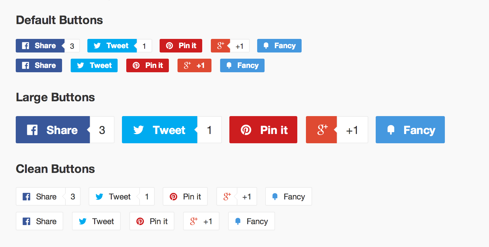

jQuery Social Sharing Buttons
=========================================

[View Demo](http://labs.carsonshold.com/social-sharing-buttons/)

Simple social sharing buttons with shared count ajax lookups.



### Required files

- fonts/
- social-buttons.css
- social-buttons.js

### Button Syntax

```
<a target="_blank" href="http://twitter.com/share?url=http://labs.carsonshold.com/social-sharing-buttons" class="share-twitter">
  <span class="icon icon-twitter"></span>
  <span class="share-title">Tweet</span>
  <span class="share-count">0</span>
</a>
```

### Button Styles
- Add class `is-large` to the surrounding `.social-sharing` div for large buttons.
- Add class `is-clean` to the surrounding `.social-sharing` div for clean buttons.
- Remove `.share-count` for a minimal button.

### Update Sass
```
sass --watch social-buttons.scss:social-buttons.css
```
